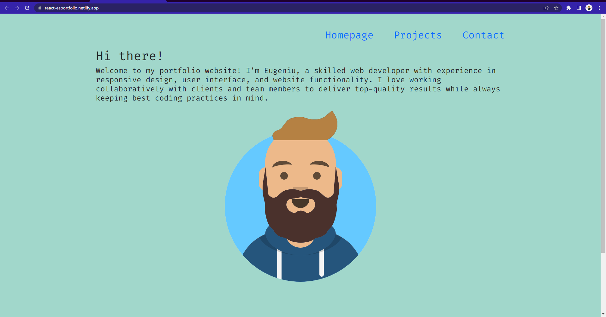
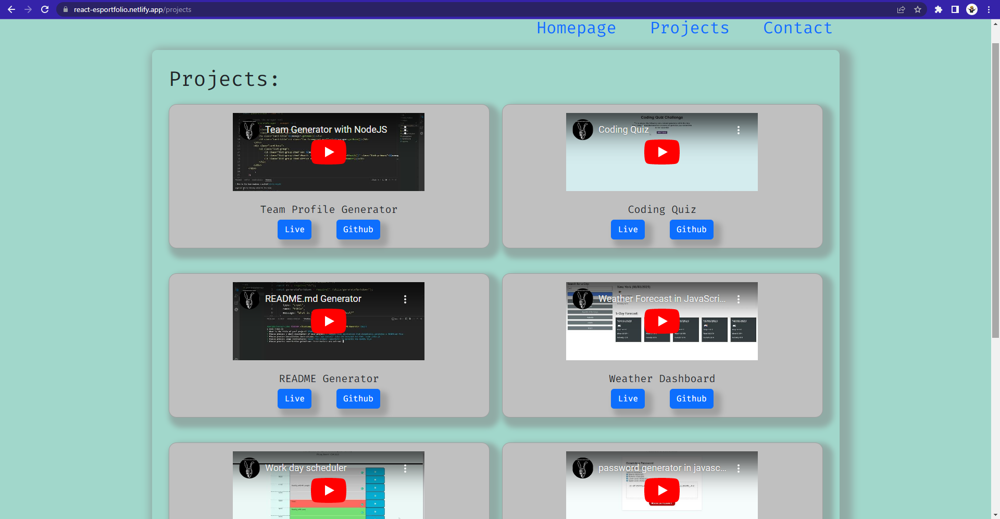

# react portfolio

## Website link:https://react-esportfolio.netlify.app/

## 
## 

## This is a React application that represents my personal portfolio. 
 

## Built with:React 

## Installation 
Run `npm install` into the terminal and then run `create react application`.

## Credits https://skillsforlife.edx.org/

## License MIT